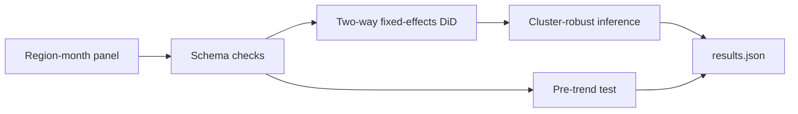

# Policy Causal Evaluation

**Role signal:** econometrics, policy analytics, causal inference.

## Executive summary

This case study estimates the average treatment effect of a regional policy using difference-in-differences. The demo recovers an effect of **-3.10 units** (95% CI: **-3.59 to -2.61**) with region and month fixed effects and standard errors clustered by region. A pre-policy differential-trend test is not significant (`p=0.149`). These findings describe seeded demo data—not a real policy.

## Why it is stronger than a prediction-only project

- Defines an explicit causal estimand (ATT).
- Controls for time-invariant region differences and common month shocks.
- Clusters uncertainty at the assignment unit.
- Tests the most visible DiD identification assumption.
- Produces a machine-readable result for a memo or dashboard.

## Architecture

## Run and adapt

Run `python analysis.py`. Replace `make_demo_panel()` with a CMS/BLS/Census extract containing `region`, `month`, `treated`, `post`, and `outcome`. For a real study, add an event-study plot, policy-timing audit, spillover discussion, and alternative comparison groups.
