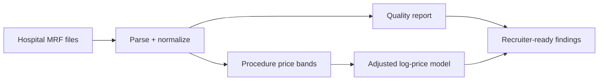

# Hospital Price Transparency Analysis

**Role signal:** healthcare analytics, messy-data engineering, interpretable modeling.

## Executive summary

The pipeline standardizes negotiated-rate fields, rejects invalid values, deduplicates hospital/procedure/payer combinations, measures procedure-level price dispersion, and estimates adjusted rural and hospital-size associations. In demo data, the median procedure has a **2.69× max-to-min rate ratio**. Demo results are illustrative, not claims about Tennessee hospitals.

## Data contract

Required columns: `hospital`, `procedure_code`, `payer`, `negotiated_rate`, `rural`, and `beds`. The rate parser handles dollar signs and thousands separators and emits a data-quality audit before modeling.

## Run and extend

Run `python analysis.py`. To productionize, ingest CMS machine-readable files, join CMS Provider of Services/ACS rurality data, retain billing-code descriptions, winsorize only with documented rules, and publish payer/procedure filters in a dashboard.
