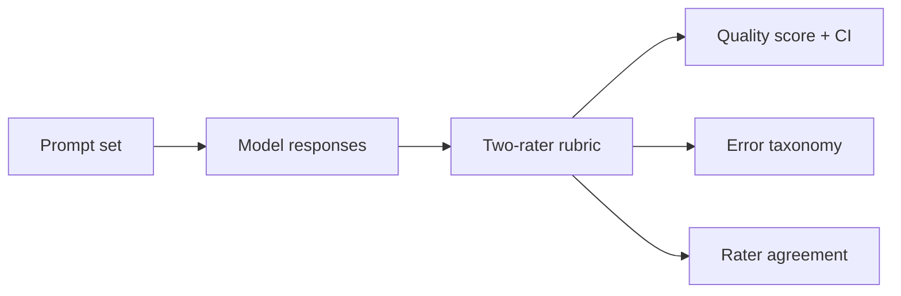

# LLM Evaluation and Error Analysis Lab

**Role signal:** AI data analysis, measurement design, human evaluation.

## Executive summary

This framework compares model correctness with bootstrap confidence intervals, breaks failures into a practical taxonomy, and quantifies inter-rater reliability. The seeded fixture evaluates 240 items per model; the top demo model scores **82.9%** and rater agreement is **κ = 0.85**. Model labels and results are synthetic to avoid implying an unsupported benchmark.

## Evaluation design

- Item-level labels across SQL, finance, healthcare, and policy prompts.
- Difficulty slices to prevent an aggregate score from hiding hard-case failures.
- Bootstrap 95% intervals rather than point estimates alone.
- Error categories: factual, instruction-following, calculation, and citation.
- Independent second-rater labels with Cohen's kappa.

Run `python evaluation.py`. Replace the demo generator with a CSV using the documented columns in the source. A production benchmark should blind model identity, version prompts and outputs, adjudicate disagreements, and pre-register primary metrics.
