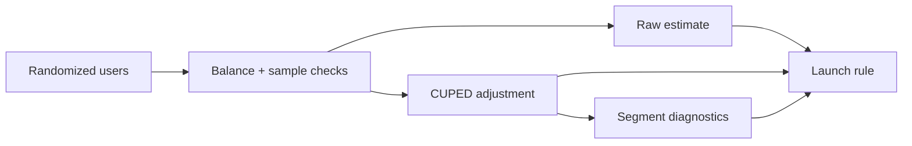

# Experimentation Decision Engine

**Role signal:** product experimentation, applied statistics, executive judgment.

## Executive summary

The engine moves from experiment data to a launch recommendation. It calculates minimum sample size, estimates raw and CUPED-adjusted effects, reports uncertainty, and checks heterogeneous effects. In the demo, CUPED removes **46% of outcome variance** and the adjusted lift is **$1.45** (95% CI: **$0.80–$2.09**), producing a `LAUNCH` recommendation against a $1 business threshold.

## Decision logic

Launch only when the CUPED interval excludes zero and the point estimate meets the minimum business effect. Segment results are diagnostic, not an excuse to cherry-pick a winning subgroup.

Run `python experiment.py`. A production version should add sample-ratio mismatch, guardrails, sequential-testing policy, novelty effects, and a pre-analysis plan.
